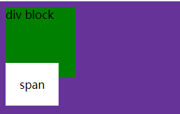
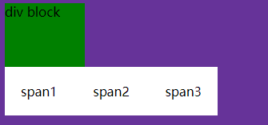

## [HTML 基本信息和全局属性](#)
> **介绍**：HTML基本信息 和 HTML中所有标签具有的公共属性。前端起步知识。

-----
* [1. doctype 标签](#1-doctype-标签)
* [2. html5 文档结构](#2-html5-文档结构)
* [3. meta 标签](#3-meta-标签)
* [4. link 与 html注释](#4-link与-html注释)
* [5. HTML中块级元素和行内元素的总结和区分](#5-HTML中块级元素和行内元素的总结和区分)
* [6. css盒模型](#6-css盒模型)
* [7. 绝对路径和相对路径](#7-绝对路径和相对路径)
* [8. HTML全局属性](#8-html全局属性)
* [9. 转义字符和输出空格](#9-转义字符和输出空格)
* [10. 标记](#10-标记)
* [11. 属性设置](#11-属性设置)

-----
### [1. doctype 标签](#)
用于声明 HTML 或 XML 文档的类型。这是 HTML 文档的第一行，位于 \<html\> 标签之前。其主要作用是 **告知浏览器文档的渲染模式**，确保浏览器以正确的方式解析和显示内容。
```html
<!-- HTML 5 如下所示 -->
<!DOCTYPE html> 
<!-- doctype 说明文档类型 如上述所示 是 html5-->

<!-- HTML 4.01 Transitional 如下所示 --> 
<!DOCTYPE HTML PUBLIC "-//W3C//DTD HTML 4.01 Transitional//EN" "http://www.w3.org/TR/html4/loose.dtd">

<!-- HTML 4.01 Strict -->
<!DOCTYPE HTML PUBLIC "-//W3C//DTD HTML 4.01//EN" "http://www.w3.org/TR/html4/strict.dtd">

<!-- XHTML 1.0 Strict -->
<!DOCTYPE html PUBLIC "-//W3C//DTD XHTML 1.0 Strict//EN" "http://www.w3.org/TR/xhtml1/DTD/xhtml1-strict.dtd">
```
Doctype 声明影响浏览器的渲染模式。如果没有正确声明，浏览器可能会进入“怪异模式”或“兼容模式”，这会影响页面的显示效果。
### [2. html5 文档结构](#)
在现代网页开发中，推荐使用 HTML5 的 Doctype (\<!DOCTYPE html\>)，因为它简单且与未来的 HTML 版本兼容。
* `<!DOCTYPE html\>`——文档类型。这是必不可少的开头。混沌初分，HTML 尚在襁褓（大约是 1991/92 年）之时，这个元素用来关联 HTML 编写规范，以供自动查错等功能所用。而在当今，它作用有限，可以说仅用于保证文档正常读取。现在知道这些就足够了。
* `<html></html\>`—— `<html\>` 元素。该元素包含整个页面的所有内容，有时候也称作根元素。里面也包含了 lang 属性，写明了页面的主要语种。
* `<head></head>`——`<head\>` 元素。所有那些你加到页面中，且不向用户展示的页面内容，都以这个元素为容器。其中包含诸如提供给搜索引擎的关键字和页面描述、用于设置页面样式的 CSS、字符集声明等标签。
* `<meta charset="utf-8"\>`——该元素指明你的文档使用 UTF-8 字符编码，UTF-8 包括世界绝大多数书写语言的字符。它基本上可以处理任何文本内容。 以它为编码还可以避免以后出现某些问题，没有理由再选用其他编码。
* `<title></title>` ——`<title\>` 元素。该元素设置页面的标题，显示在浏览器标签页上，也作为收藏网页的描述文字。
* `<body></body>` ——`<body\>` 元素。该元素包含期望让用户在访问页面时看到的全部内容，包括文本、图像、视频、游戏、可播放的音轨或其他内容。

**实例**：
```html
<!DOCTYPE html>
<html lang="en">
<head>
    <meta charset="UTF-8">
    <meta http-equiv="X-UA-Compatible" content="IE=edge">
    <meta name="viewport" content="width=device-width, initial-scale=1.0">
    <link href="styles/style.css" rel="stylesheet" />
    <script src="scripts/main.js" defer></script>
    <title>Document</title>
</head>
<body>
    
</body>
</html>
```

#### [2.1 head标签](#)
HTML `<html>` 元素表示 HTML 文档的根（顶级元素），所以它也被称为根元素。其他所有元素必须是此元素的后代,该元素包含[全局属性](https://developer.mozilla.org/zh-CN/docs/Web/HTML/Global_attributes)。

在 `<html>` 元素上提供一个带有有效语言标记的 **lang** 属性，将有助于屏幕阅读技术确定要宣告的适当语言。标识语言标签应描述页面大部分内容所使用的语言。
lang的取值可参考 FC 5646: Tags for Identifying Languages（也称为 BCP 47） 中定义。

```javascript
var RFC5646_LANGUAGE_TAGS = {
  'zh': 'Chinese',
  'zh-CN': 'Chinese (S)',
  'zh-HK': 'Chinese (Hong Kong)',
  'zh-MO': 'Chinese (Macau)',
  'zh-SG': 'Chinese (Singapore)',
  'zh-TW': 'Chinese (T)',
  'ru': 'Russian',
  'ru-RU': 'Russian (Russia)',
  'en': 'English',
  'en-AU': 'English (Australia)',
  'en-BZ': 'English (Belize)',
  'en-CA': 'English (Canada)',
  'en-CB': 'English (Caribbean)',
  'en-GB': 'English (United Kingdom)',
  'en-IE': 'English (Ireland)',
  'en-JM': 'English (Jamaica)',
  'en-NZ': 'English (New Zealand)',
  'en-PH': 'English (Republic of the Philippines)',
  'en-TT': 'English (Trinidad and Tobago)',
  'en-US': 'English (United States)',
  'en-ZA': 'English (South Africa)',
  'en-ZW': 'English (Zimbabwe)',
  'ja': 'Japanese',
  'ja-JP': 'Japanese (Japan)',
  
}
```

### [3. meta 标签](#)
<meta> 标签是 HTML 语言头部的一个辅助性标签，提供有关页面的元信息（比如：针对搜索引擎和更新频度的描述和关键词、定义页面使用的语言），使用好 <meta> 标签对 HTML 很有益。
meta标签通常放置在 <head> 标签内，不直接显示在页面上。

* **http-equiv** : content-type/expires/refresh/set-cookie 把 content 属性关联到 HTTP 头部，可以设置页面的行为或传递给浏览器一些控制指令，这些指令通常是通过 HTTP 响应头部传递的。
* **name** : author/description/keywords/generator/revised/others 把 content 属性关联到一个名称。
* **scheme**: some_text	定义用于翻译 content 属性值的格式。
* **content** : some_text	定义与 http-equiv 或 name 属性相关的元信息

```html
实例 1 - 定义文档关键词，用于搜索引擎：
<meta name="keywords" content="HTML, CSS, XML, XHTML, JavaScript">

实例 2 - 定义web页面描述：
<meta name="description" content="Free Web tutorials on HTML and CSS">

实例 3 - 定义页面作者：
<meta name="author" content="Hege Refsnes">

实例 4 - 每30秒刷新页面：
<meta http-equiv="refresh" content="30">

实例5 - 定义文档的编码
<meta charset="UTF-8">

实例6 - 视口元素可以确保页面以视口宽度进行渲染，避免移动端浏览器上因页面过宽导致缩放。
<meta name="viewport" content="width=device-width, initial-scale=1.0">
主要用于响应式设计，控制页面在不同设备上的布局。width=device-width 设置视口宽度等于设备宽度，initial-scale=1.0 设置初始缩放比例。

实例7 - 指示浏览器不要缓存页面内容，确保用户每次访问时都能获取最新的页面。
<meta http-equiv="cache-control" content="no-cache">

实例8 - 设置文档的 MIME 类型和字符集。这在较旧的 HTML 文档中常见，现在更常用
<meta http-equiv="Content-Type" content="text/html; charset=UTF-8">

实例9 - 指定页面内容过期的时间。浏览器会在该时间之后认为页面内容已过期，需要从服务器获取新版本。
<meta http-equiv="expires" content="Wed, 21 Oct 2025 07:28:00 GMT">

实例10 -  指定 Internet Explorer 应该使用何种模式渲染页面。IE=edge 指示使用最新版本的渲染
引擎，而不是兼容模式。这个设置在需要兼容旧版 IE 时特别有用。
<meta http-equiv="X-UA-Compatible" content="IE=edge">

实例11 - 设置内容安全策略，控制哪些资源可以加载和执行。CSP 可以防止 XSS 攻击，增强网页的安全性。
<meta http-equiv="Content-Security-Policy" content="default-src 'self'">
default-src 'self' 表示页面只能加载来自相同源的内容。
script-src ... 常见的 Content-Security-Policy 指令及其值 有很多个需要再查询
```


### [4. link 与 html注释](#)

#### 4.1 link 标签
指定当前文档与外部资源的关系。该元素最常用于链接 CSS，此外也可以被用来创建站点图标（比如“favicon”样式图标和移动设备上用以显示在主屏幕的图标）。
该标签位于head标签内部。详情可以查看[MDN link](https://developer.mozilla.org/zh-CN/docs/Web/HTML/Element/link)
```html
<link href="styles/style.css" rel="stylesheet" />

<link rel="icon" href="favicon.ico" type="image/x-icon" />

sizes 属性表示图标大小，type 属性包含了链接资源的 MIME 类型。这些属性为浏览器选择最合适的图标提供了有用的提示。
<link rel="apple-touch-icon" sizes="114x114"  href="apple-icon-114.png" type="image/png" />

你也可以在 media 属性中提供媒体类型或查询；这种资源将只在满足媒体条件的情况下才会加载。
<link href="mobile.css" rel="stylesheet" media="screen and (max-width: 600px)" />

crossorigin 属性表示该资源是否应该使用一个 CORS 请求来获取。
<link rel="preload" href="myFont.woff2" as="font" type="font/woff2" crossorigin="anonymous" />
```

1. **通过媒体查询有条件地加载资源** 你可以在media属性中提供媒体类型或查询; 然后，只有在媒体条件为 true 时，才会加载此资源。例如：
```html
<link href="print.css" rel="stylesheet" media="print" />
<link href="mobile.css" rel="stylesheet" media="all" />
<link href="desktop.css" rel="stylesheet" media="screen and (min-width: 600px)" />
<link href="highres.css" rel="stylesheet"  media="screen and (min-resolution: 300dpi)" />
```
2. **样式表加载事件** 你能够通过监听发生在样式表上的 load 事件知道什么时候样式表加载完毕。同样的，你能够通过监听 error 事件检测到是否在加载样式表的过程中出现错误。
```html
<script>
  const stylesheet = document.querySelector("#my-stylesheet");

  stylesheet.onload = () => {
    // 做点有意思的事情，样式表已经加载了
  };

  stylesheet.onerror = () => {
    console.log("加载样式表时发生错误！");
  };
</script>

<link rel="stylesheet" href="mystylesheet.css" id="my-stylesheet" />
```

3. **在获取资源前阻止渲染** 可以在 blocking 属性中包含 render 标记；页面的渲染将被阻止，直到资源被获取。例如：
```html
<link blocking="render" rel="preload" href="critical-font.woff2" as="font" crossorigin />
```

#### [4.2 html 注释](#)
html 注释，注释在浏览器中不会显示。 `<!--...-->` 注释标签不支持任何事件属性、标准属性。。
```html
<!-- 注释内容 -->
```

### [5. HTML中块级元素和行内元素的总结和区分](#)
**块级元素**:**每个块级元素通常都会独占一行或者是多行，可以对其单独设置高度,宽度以及对齐等属性**。
常见的块级元素有：`<h1>~<h6>,<p>,<div>,<ul>,<ol>,<li>`等

**行内元素（内联元素）**：不占有独立的区域，仅仅依靠自己的字体大小或者是图像大小来支撑结构。
一般不可以设置宽度，高度以及对齐等属性。 常见的行内元素有：`<a >,<strong>,<b>,<em>,<del>,<span >` 等,默认的宽度就是它本身的宽度

**行内块级元素**:块级元素，它既具有块级元素的特点，也有行内元素的特点，它可以自由设置元宽度和高度，
也可以在一行中放置多个行内块级元素。比如input、img就是行内块级元素，它可以设置高宽以及一行多个。

#### 5.1 块级元素
占父容器的一行，里面可以容纳其他标签和文本，并且默认情况下会在前后创建换行。块级元素可以设置宽度、高度、内外边距等样式属性。
* 总是在新行上开始，可以对其单独设置高度,宽度(width, height),以及对齐等属性。
* 宽度缺省是它的容器的100%，除非设定一个宽度。
* 它可以容纳内联元素和其他块元素

#### 5.2 行内元素
行内元素的**宽度和高度通常由其内容决定**，而不是由元素本身的 width 或 height 属性决定。即使设置了 width 或 height，也不会对行内元素产生明显影响。

1. 可以设置 padding 和 margin 属性，但控制有限。特别是 margin 和 padding 的**上下部分不会像块级元素那样扩展整个行**，而是仅在文本内容周围生效。
    * 设置padding 只有左右padding有效，上下则无效。注意元素范围是增大了， 但是对元素周围的内容是没影响的。
    * 设置margin 只有左右margin有效，**上下无效**。
    

2. 可以设置 border、background-color、color、font-family 等属性。
3. 和其他元素都在一行上；


4. 通过css的display属性对行内元素和块级元素进行切换：
```css
.b_test{
    display:block;/*定义元素为块级元素*/ 
    display:inline;/*定义元素为行内元素*/ 
    display:inline-block;/*定义行内块级元素*/
}
```
#### [5.3 行内块级元素](#)
行内块级元素在同一行内显示，但是它们可以设置宽度和高度，并且可以像块级元素一样设置内外边距。它们不会强制换行，可以在一行内显示多个行内块级元素。
1. 在同一行内显示。
2. 可以设置宽度和高度。
3. 可以设置内外边距。
4. 不会强制换行。

示例行内块级元素：``，`<button>`， `<select>`，`<input>`等。

### [6. css盒模型](#)
所有HTML元素可以看作盒子，在CSS中，"box model"这一术语是用来设计和布局时使用。CSS盒模型本质上是一个盒子，封装周围的HTML元素，它包括：边距，边框，填充，和实际内容。盒模型允许我们在其它元素和周围元素边框之间的空间放置元素。


不同部分的说明：
* Margin(外边距): 清除边框外的区域，外边距是透明的。
* Border(边框): 围绕在内边距和内容外的边框。
* Padding(内边距): 清除内容周围的区域，内边距是透明的。
* Content(内容):盒子的内容，显示文本和图像。

怪异模式和标准模式下的css盒模型的解析：
* **标准模式中**，网页元素的宽度是有padding,border,width三者的宽度相加决定的。
* **怪异模式中**，width包含padding和border的宽度，即网页宽度为width。

css3新增box-sizing属性，用于更改用于计算元素宽度和高度的默认的 CSS 盒子模型：
* **content-box**:默认值。如果你设置一个元素的宽为100px，那么这个元素的内容区会有100px宽，并且任何边框和内边距的宽度都会被增加到最后绘制出来的元素宽度中，即标准模式下的盒模型。
* **border-box**: 告诉浏览器去理解你设置的边框和内边距的值是包含在width内的。也就是说，如果你将一个元素的width设为100px,那么这100px会包含其它的border和padding，内容区的实际宽度会是width减去border + padding的计算值，即怪异模式下的盒模型。·

### [7. 绝对路径和相对路径](#)
太简单了，都懒得写,自行百度或者领悟。
* ./pics/enlai.jpg : 当前目录下的pics文件夹的图片
* pin/xinyang.jpg : 同级文件夹pin里面的xinyang.jpg文件
* ../by.jpg : 上级文件夹里的图片
* ../static/by.jpg : 上级文件夹中static目录里的图片


### [8. HTML全局属性](#)
元素也可以拥有属性，属性看起来像这样：
```html
<div class="user-block">div block</div>

<a href="www.badiu.com" target="_blank" title="go to 百度">百度一下</a>
```
属性包含元素的额外信息，这些信息不会出现在实际的内容中。在上述例子中，这个 class 属性是一个识别名称，以后为元素设置样式信息时更加方便。

**属性必须包含**：
* 一个空格，它在属性和元素名称之间。如果一个元素具有多个属性，则每个属性之间必须由空格分隔。
* 属性名称，后面跟着一个等于号。
* 一个属性值，由一对引号（""）引起来。

**布尔属性**:有时你会看到没有值的属性，这也是完全可以接受的。这些属性被称为布尔属性。布尔属性只能有一个值，这个值一般与属性名称相同。
```html
<input type="text" disabled="disabled" />

<!-- 使用 disabled 属性来防止终端用户输入文本到输入框中 -->
<input type="text" disabled />
```


全局属性是可与所有 HTML 元素一起使用的属性。HTML5也新增了很多属性。 需要记住的有: class data- dir hidden id lang spellcheck title translate。

|属性| 说明                                                                                                                                 |
|--|------------------------------------------------------------------------------------------------------------------------------------|
|*accesskey*| 规定激活（使元素获得焦点）元素的便捷按键。 opera 不支持 [极不通用]                                                                                             |
|*autocapitalize*| 控制用户的文本输入是否和如何自动大写                                                                                                                 |
|*autofocus*| 表示一个元素将在页面加载时自动聚焦，该属性是一个布尔值，初始化为 false。                                                                                            |
|**class**	| 规定元素的一个或多个类名（引用样式表中的类）。                                                                                                            |
|contenteditable| 	规定元素内容是否可编辑。[用处不大]                                                                                                                |
|contextmenu| 规定元素的上下文菜单。上下文菜单在用户点击元素时显示。[没有浏览器支持]                                                                                               |
|**data-***| 用于存储页面或应用程序的私有定制数据。                                                                                                                |
|**dir**| 	规定元素中内容的文本方向。                                                                                                                     |
|**draggable**| 规定元素是否可拖动,属性为布尔值。具体的拖动操作需要js事件来实现, 参考[Drag and Drop API](https://developer.mozilla.org/zh-CN/docs/Web/API/HTML_Drag_and_Drop_API), |
|dropzone| 	规定在拖动被拖动数据时是否进行复制、移动或链接。[目前所有主流浏览器都不支持 dropzone 属性。]                                                                              |
|**hidden**	| 规定元素还没有或不再相关，它可以用来隐藏页面中的元素。                                                                                                        |
|**id**	| 规定元素的唯一 id。[十分常用了]                                                                                                                 |
|**lang**| 规定元素内容的语言。                                                                                                                         |
|**spellcheck**| 	规定是否对元素进行拼写和语法检查。                                                                                                                 |
|**style**| 	规定元素的行内 CSS 样式。[把样式写在html文档中是要遭天谴的，绝对不推荐使用]                                                                                       |
|tabindex| 	规定元素的 tab 键次序。默认是自顶向下，一般不设置                                                                                                       |
|**title**| 	规定有关元素的额外信息。就是当你鼠标悬停的时候现实的信息                                                                                                      |
|**translate**| 	规定是否应该翻译元素内容。                                                                                                                     |

除了基本的 HTML 全局属性之外，还存在以下全局属性：
* JavaScript 事件处理器属性：onabort、onautocomplete、onautocompleteerror、onblur、oncancel、oncanplay、oncanplaythrough、
onchange、onclick、onclose、oncontextmenu、oncuechange、ondblclick、ondrag、ondragend、ondragenter、ondragleave、
ondragover、ondragstart、ondrop、ondurationchange、onemptied、onended、onerror、onfocus、oninput、oninvalid、
onkeydown、onkeypress、onkeyup、onload、onloadeddata、onloadedmetadata、onloadstart、onmousedown、onmouseenter、
onmouseleave、onmousemove、onmouseout、onmouseover、onmouseup、onmousewheel、onpause、onplay、onplaying、
onprogress、onratechange、onreset、onresize、onscroll、onseeked、onseeking、onselect、onshow、onsort、
onstalled、onsubmit、onsuspend、ontimeupdate、ontoggle、onvolumechange、onwaiting。
* ARIA role 和多重 aria-* 状态和属性，用于保证无障碍。**几乎不用**
#### 8.1 data-*
可以实现数据的定制化
```html
<span data-id="20161110418">学号</span>
```

#### 8.2 dir
* ltr : 默认值,从左向右的文本方向。
* rtl : 从右向左的文本方向。
* auto : 指由用户代理决定方向。它在解析元素中字符时会运用一个基本算法，直到发现一个具有强方向性的字符，然后将这一方向应用于整个元素。
```html
<p dir="ltr">大家好啊，我是李志明的父亲大人</p>
<p dir="rtl">大家好啊, 我是李志明的父亲大人</p>
```

#### 8.3 dropzone
```html
<element dropzone="copy|move|link">
```

#### 8.4 hidden
hidden 属性也可用于防止用户查看元素，直到匹配某些条件（比如选择了某个复选框）。然后，JavaScript 可以删除 hidden 属性，以使此元素可见。

注: 这只是不对节点进行html解析和渲染，节点任然在html文档中，并没有消失，只是看不见了
```html
<p  hidden="true">大家好啊，我是李志明的父亲大人,我被隐藏了</p>
<p >大家好啊, 我是李志明的父亲大人</p>
```

#### 8.5 title
```html
<a href="http://www.baidu.com" title="我即将跳转到百度去了">百度一下<a/>
```

#### 8.6 autocapitalize
控制用户的文本输入是否和如何自动大写，它可以有以下的值，**主要针对移动设备上的虚拟键盘，因此在桌面浏览器或一些不支持的设备上，这个属性可能不起作用**。
* off 或 none，不应用自动大写（所有字母都默认为小写字母）。
* on 或 sentences，每个句子的第一个字母默认为大写字母，所有其他字母都默认为小写字母。
* words，每个单词的第一个字母默认为大写字母，所有其他字母都默认为小写字母。
* characters，所有的字母都应该默认为大写。

### [9. 转义字符和输出空格](#)
输出一些特殊字符需要使用到HTML转义字符  link： [html转义字符表](https://tool.oschina.net/commons?type=2)

| 原义字符 |等价字符引用|
|:-----|:---|
| `<`    |	`&lt;`|
| `>`    |	`&gt;`|
| `"`    |	`&quot;`|
| `'`    |	`&apos;`|
| `&`    |	`&amp;`|

```html
&nbsp;你们好
<p class="a">
    输出一个a标签：&lta&gt;
</p>
```
输出
```
 你们好
输出一个a标签：<a>
```

### [10. 标记说明](#)
HTML 5的语法是为了保证与之前的HTML语法也能够达到最大程度的兼容而设计的。

例如，符合“没有\<p\>的结束标记”的HTML代码随处可见，HTML 5中并没有把这种情况作为错误来处理，而是允许存在这种情况，但明确规定了这种情况应该怎么处理。

那么，针对这个问题，我们从元素标记的省略、具有boolean值的属性、引号的省略这几方面来详细看一下在HTML 5中是如何确保与之前版本的HTML实现兼容的。


#### 10.1 可以省略标记的元素
在HTML 5中，元素的标记可以省略。具体来说，分为“不允许写结束标记”、“可以省略结束标记”和“开始标记和结束标记全部可以省略”三种类型。

* 不允许写结束标记的元素有：area、base、br、col、command、embed、hr、img、input、keygen、link、meta、param、source、track、wbr。
* 可以省略结束标记的元素有：li、dt、dd、p、rt、rp、optgroup、option、colgroup、thead、tbody、tfoot、tr、td、th。
* 可以省略全部标记的元素有：html、head、body、colgroup、tbody。

不允许写结束标记的元素”是指不允许使用开始标记与结束标记将元素括起来的形式，只允许使用“<元素/>”的形式进行书写。例如“`<br>...</br>`”的书写方
式是错误的，只允许`“<br/>”`的书写形式。当然，HTML 5之前的`<br>`这种写法可以被沿用。

```html
<!-- 正确用法：-->
<input type="text" name="username">
<!-- XHTML 风格（也正确）：-->
<input type="text" name="username" />
<!-- 不建议的用法：-->
<input type="text" name="username"></input>
```

#### [11. 属性设置](#)
对于具有boolean值的属性，例如disabled与readonly等，当只写属性而不指定属性值时，表示属性值为true，如果想要将属性值设为false，则可以不使用该属性。
另外，要想将属性值设定为true时，也可以将属性名设定为属性值，或将空字符串设定为属性值。