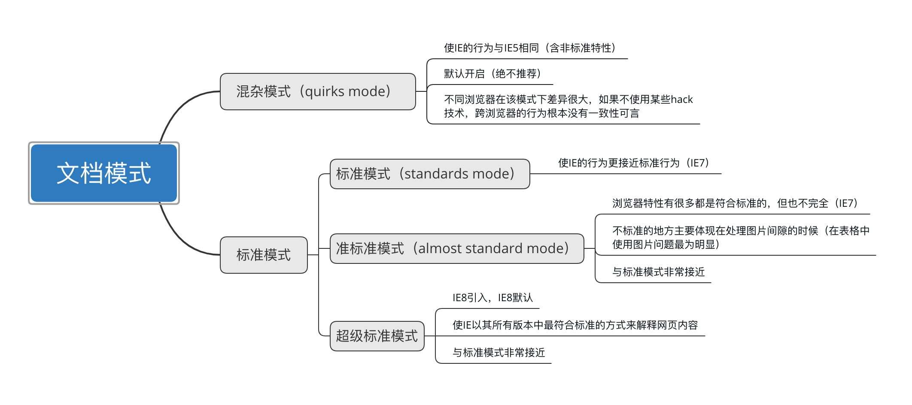

### [JavaScript 原生学习笔记](https://developer.mozilla.org/en-US/docs/Web/JavaScript)
> **介绍**： 学习如何在HTML中使用、引入JavaScript代码。

----

- [1. 在HTML中使用Javasript](#1-在HTML中使用Javasript)
- [2. 文档模式](#2-文档模式)

-----
### [1. 在HTML中使用Javasript](#)
使用 script 元素，分两种情况, 如下所示, script 是一个html标签详情可以查看 [MDN script](https://developer.mozilla.org/zh-CN/docs/Web/HTML/Element/script) 。
* 外部脚本 
* 页面嵌入式脚本

```html
<script src="./index.js" type="text/javascript" ></script> <!-- 外部脚本 -->
<script type="text/javascript" >
    var msg = "i am inner script";
    alert(msg);
</script> <!-- 嵌入式脚本 -->
```

script 元素的基本属性 : 一般将外部脚本引用写在html文档底部
* async [**一般不使用**](#): 值: async 规定异步执行脚本（仅适用于外部脚本）。可选标识立即下载脚本，但是不应该妨碍页面中的其他操作。比如下载其他资源活等待加载其他脚本，只对外部文件有效
    * 如果 async="async"：脚本相对于页面的其余部分异步地执行（当页面继续进行解析时，脚本将被执行）
    * 如果不使用 async 且 defer="defer"：脚本将在页面完成解析时执行
    * 如果既不使用 async 也不使用 defer：在浏览器继续解析页面之前，立即读取并执行脚本
* src：属性规定外部脚本文件的 URL。
    * 绝对 URL - 指向其他站点（比如 `src="www.example.com/example.js"` ）
    * 相对 URL - 指向站点内的文件（比如 src="/scripts/example.js"）
* defer: 值为defer 规定是否对脚本执行进行延迟，直到页面加载为止。 只有 Internet Explorer 支持 defer 属性。
* type:
  * text/javascript **默认值** 
  * **module**，则代码会被当成ES6模板，而且只有在这时候代码中才能出现import和export关键字
* crossorigin:可选，配置相关请求的跨院资源共享 `[Cross-Origin Resource Sharing (CORS)]` 设置。默认不使用.两个值 1 anonymous	此元素的 CORS 请求会将凭据标志设置为“同源”。 2.use-credentials	对此元素的 CORS 请求会将凭据标志设置为“包含”。
* integrity:这个 integrity 属性的值来 指定浏览器提取的资源（文件）的base64编码的加密哈希值。如果资源匹配其中一个哈希值，它将被加载。
html5 规定按照他们出现的先后顺序执行脚本代码，在现实中延迟脚本并不一定会按照顺序执行，也不一定会在DOMContendLoaded 事件出发前执行
* nonce 允许脚本的一个一次性加密随机数（nonce）。服务器每次传输策略时都必须生成一个唯一的 nonce 值。提供一个无法猜测的 nonce 是至关重要的，因为绕过一个资源的策略是微不足道的。


### [2. 文档模式](#)
ES5 引入了文档模式的概念，通过使用DOCTYPE实现模式切换，它的主要作用是告诉浏览器以哪种模式呈现，如何解析文档，也就是说两种模式主要影响CSS内容的呈现，某些情况下也会影响JavaScript的执行。

文档模式的类型
* 混杂模式：向后兼容的解析方式
* 标准模式：要求严格的DTD，根据web标准去解析页面的模式。
* 准标准模式：准标准模式与标准模式非常接近，它们的差异几乎可以忽略不计。

两种模式的区别
* 盒模型的解析
    * 混杂模式盒模型的宽高=内容的宽高；
    * 标准模式盒模型的宽高=内容的宽高+padding的宽高+border的宽高。
* 图片的布局
    * 当一个块元素div中包含的内容只有图片时，在标准模式下，不管IE还是标准，在图片底部都有3像素的空白。但在混杂模式下，标准浏览器（Chrome）中div距图片底部默认没有空白

